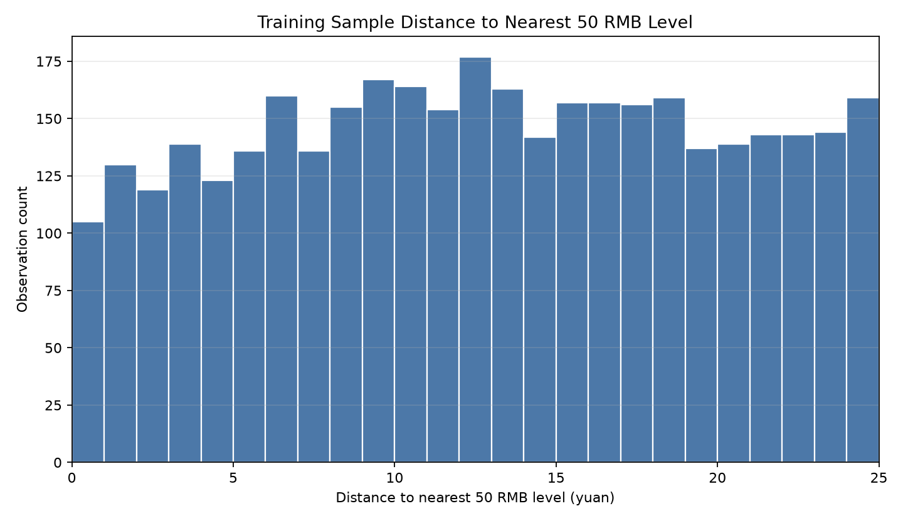

# Training Sample Distance Distribution

The uniform line is a visual benchmark, not a formal maintained null hypothesis.

- The uniform reference assumes independent observations, which this series does not satisfy: the distance series is highly persistent and the nearest level changes only about 133 times across 3,664 days.
- Deviations from the uniform line must not be read as evidence of a round-number effect.
- The correct null is constructed in Stage 4 by moving-block bootstrap, and its centre is not the uniform value.
- Stage 3 is descriptive only: it measures the distribution; Stage 4 supplies the standard of comparison.

## Scope

- Input file: `outputs/stage2_variable_construction/au9999_analysis_dataset.csv`
- Training sample: 2006-01-01 to 2020-12-31, inclusive.
- Data from 2021-01-01 onward was not used for charts, summary statistics, threshold choice, or interpretation.
- Task scope: only the distribution of closing-price distance to the nearest 50 RMB level.
- No return, volatility, volume comparison, regression, or significance test was performed.

## Training Sample

- Actual start date: 2006-01-04
- Actual end date: 2020-12-31
- Observations: 3,664
- Valid Distance observations: 3,664
- Theoretical Distance range check, 0 to 25 yuan: pass

## Distance Formula

`Distance_t = abs(Close_t - 50 * round(Close_t / 50))`

This script uses transparent half-up rounding: when a close is exactly at the midpoint between two 50-yuan levels, the higher level is selected.

## Basic Descriptive Statistics

| metric | value       |
| ------ | ----------- |
| count  | 3664.000000 |
| mean   | 12.784378   |
| std    | 6.986038    |
| min    | 0.000000    |
| 25%    | 7.000000    |
| 50%    | 12.750000   |
| 75%    | 18.582500   |
| max    | 25.000000   |

## One-Yuan Distance Bins

| distance_bin_yuan | observation_count | proportion |
| ----------------- | ----------------- | ---------- |
| [0,1)             | 105               | 0.028657   |
| [1,2)             | 130               | 0.035480   |
| [2,3)             | 119               | 0.032478   |
| [3,4)             | 139               | 0.037937   |
| [4,5)             | 123               | 0.033570   |
| [5,6)             | 136               | 0.037118   |
| [6,7)             | 160               | 0.043668   |
| [7,8)             | 136               | 0.037118   |
| [8,9)             | 155               | 0.042303   |
| [9,10)            | 167               | 0.045579   |
| [10,11)           | 164               | 0.044760   |
| [11,12)           | 154               | 0.042031   |
| [12,13)           | 177               | 0.048308   |
| [13,14)           | 163               | 0.044487   |
| [14,15)           | 142               | 0.038755   |
| [15,16)           | 157               | 0.042849   |
| [16,17)           | 157               | 0.042849   |
| [17,18)           | 156               | 0.042576   |
| [18,19)           | 159               | 0.043395   |
| [19,20)           | 137               | 0.037391   |
| [20,21)           | 139               | 0.037937   |
| [21,22)           | 143               | 0.039028   |
| [22,23)           | 143               | 0.039028   |
| [23,24)           | 144               | 0.039301   |
| [24,25)           | 154               | 0.042031   |

## Near-Threshold Counts

| threshold_yuan | observation_count | actual_proportion | uniform_reference_proportion | actual_minus_uniform_reference |
| -------------- | ----------------- | ----------------- | ---------------------------- | ------------------------------ |
| 2.000000       | 246.000000        | 0.067140          | 0.080000                     | -0.012860                      |
| 3.000000       | 365.000000        | 0.099618          | 0.120000                     | -0.020382                      |
| 5.000000       | 631.000000        | 0.172216          | 0.200000                     | -0.027784                      |
| 10.000000      | 1395.000000       | 0.380731          | 0.400000                     | -0.019269                      |

## Charts

## Direct Visual Reading

- Main near definition, Distance <= 5: 631 observations, 17.22% of the training sample.
- Uniform visual reference for Distance <= 5 is 20.00%; actual minus reference is -2.78%.
- This is exploratory description only.
- Based on this chart/table alone, do not claim a round-number effect, support/resistance, or tradable regularity.