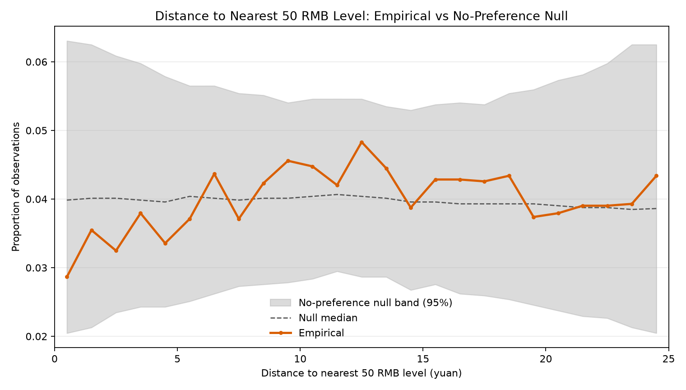

# Stage 4: Round-Number Avoidance Test

## Scope

This stage tests whether training-sample closing prices avoid round 50-RMB levels
beyond what a mechanical price process would produce. It uses the training window
2006-01-01 to 2020-12-31 only; data from 2021 onward is held out.
It tests the distance distribution only, and does not study support/resistance,
next-day returns, volatility, or trading rules.

## Why a naive test is not enough

The distance-to-level series is highly persistent (lag-1 autocorrelation ~0.94;
the nearest 50-level changes only about 133 times across the sample). Treating
each day as an independent observation overstates significance. This stage instead
compares the empirical distance distribution to a Monte Carlo null.

## Null model

- Under the null, prices have NO round-number preference.
- Null paths start at the first training close and are built by moving-block
  bootstrap of the actual daily log returns.
- Block length: 20 trading days (preserves short-run
  autocorrelation and fat tails while breaking any price-level/return link).
- Simulations: 2000. Seed: 12345 (reproducible).
- Seed 12345 is shared with Stage 5 (`test_level_proximity_volatility.py`): both stages draw the same block-start array from the same return series, so their null paths are bit-identical. Each test is individually valid -- the shared paths are a valid sample from the null -- but the two results are NOT independent and must not be described as two independent tests both failing to reject; sharing paths makes the two stages a deliberately controlled comparison.

## Input

- File: `au9999_analysis_dataset.csv`
- Training observations: 3,664
- Start price for null paths: 138.21

## Statistic Comparison

| statistic | empirical | null_median | null_p2.5 | null_p97.5 | empirical_percentile_in_null | two_sided_p | outside_95_null_band |
| --- | --- | --- | --- | --- | --- | --- | --- |
| mean_distance | 12.784378 | 12.416983 | 10.458997 | 14.455598 | 65.5 | 0.6907 | False |
| prop_distance_le_2.0 | 0.06714 | 0.079967 | 0.042849 | 0.12309 | 22.8 | 0.4628 | False |
| prop_distance_le_3.0 | 0.099618 | 0.120906 | 0.067413 | 0.180411 | 21.1 | 0.4288 | False |
| prop_distance_le_5.0 | 0.172216 | 0.201146 | 0.119808 | 0.292856 | 22.4 | 0.4518 | False |
| prop_distance_le_10.0 | 0.380731 | 0.402566 | 0.282983 | 0.526754 | 34.2 | 0.6857 | False |

`empirical_percentile_in_null` is where the empirical value sits within the null
distribution (50 = dead centre). `outside_95_null_band` is the decision flag.

The four `prop_distance_le_*` rows are nested: every observation counted at 2 is also counted at 3, 5, and 10. They are cumulative slices of one distribution, so any shift moves all four together -- the progression across thresholds is one number reported four times, not four independent signals agreeing. `main_near_threshold = 5` was fixed in advance and is the pre-specified headline; the 2, 3, and 10 rows are robustness checks and must not be read as corroboration.

## Per-Bin Empirical vs Null Band

| distance_bin_yuan | empirical_proportion | null_median | null_p2.5 | null_p97.5 | empirical_below_null_band | empirical_above_null_band |
| --- | --- | --- | --- | --- | --- | --- |
| [0,1) | 0.028657 | 0.039847 | 0.020463 | 0.063053 | False | False |
| [1,2) | 0.03548 | 0.04012 | 0.021288 | 0.0625 | False | False |
| [2,3) | 0.032478 | 0.04012 | 0.023465 | 0.060862 | False | False |
| [3,4) | 0.037937 | 0.039847 | 0.02429 | 0.059771 | False | False |
| [4,5) | 0.03357 | 0.039574 | 0.02429 | 0.05786 | False | False |
| [5,6) | 0.037118 | 0.040393 | 0.025102 | 0.056496 | False | False |
| [6,7) | 0.043668 | 0.04012 | 0.026201 | 0.056502 | False | False |
| [7,8) | 0.037118 | 0.039847 | 0.027293 | 0.055404 | False | False |
| [8,9) | 0.042303 | 0.04012 | 0.027566 | 0.055131 | False | False |
| [9,10) | 0.045579 | 0.04012 | 0.027838 | 0.054039 | False | False |
| [10,11) | 0.04476 | 0.040393 | 0.028377 | 0.054585 | False | False |
| [11,12) | 0.042031 | 0.040666 | 0.029476 | 0.054592 | False | False |
| [12,13) | 0.048308 | 0.040393 | 0.028657 | 0.054585 | False | False |
| [13,14) | 0.044487 | 0.04012 | 0.028657 | 0.053493 | False | False |
| [14,15) | 0.038755 | 0.039574 | 0.026747 | 0.052948 | False | False |
| [15,16) | 0.042849 | 0.039574 | 0.027566 | 0.053766 | False | False |
| [16,17) | 0.042849 | 0.039301 | 0.026201 | 0.054039 | False | False |
| [17,18) | 0.042576 | 0.039301 | 0.025928 | 0.053773 | False | False |
| [18,19) | 0.043395 | 0.039301 | 0.025375 | 0.055404 | False | False |
| [19,20) | 0.037391 | 0.039301 | 0.024556 | 0.05595 | False | False |
| [20,21) | 0.037937 | 0.039028 | 0.023745 | 0.057314 | False | False |
| [21,22) | 0.039028 | 0.038755 | 0.022926 | 0.058133 | False | False |
| [22,23) | 0.039028 | 0.038755 | 0.022653 | 0.059771 | False | False |
| [23,24) | 0.039301 | 0.038483 | 0.021288 | 0.062507 | False | False |
| [24,25) | 0.043395 | 0.038619 | 0.020469 | 0.062507 | False | False |

## Chart

## Interpretation

The empirical distance statistics all fall INSIDE the 95% no-preference null band. The apparent avoidance of round 50-RMB levels is statistically indistinguishable from what a mechanical price process with the same return behaviour produces. We cannot claim a genuine round-number avoidance effect from this evidence.

- Mean distance: empirical 12.784378 vs null median 12.416983 (95% null band 10.458997 to 14.455598), two-sided p = 0.6907.
- Distance bin [0,1): empirical 0.028657 vs null median 0.039847 (band 0.020463 to 0.063053).
- Of the 5 bins nearest a level (0-5 yuan), 0 sit below the null band.

## Why the null centre is not 12.5

The 2,000 simulated paths have zero round-number preference by construction: the resampling never consults the price level, so no path can prefer or avoid a level. Their median mean-distance is nevertheless 12.4170, below the uniform 12.5.

So "mean distance differs from 12.5, therefore prices avoid round numbers" is false: a provably-no-effect world already fails to produce 12.5. Uniformity is what infinitely many independent draws would give; one persistent 14-year path crossing roughly 133 levels gives something else, and individual null paths span a wide range (10.4590 to 14.4556 at 95%).

| reference | centre | lower_95 | upper_95 | obs_minus_centre | SE_from_centre |
| --- | --- | --- | --- | --- | --- |
| uniform iid benchmark | 12.5 | 12.2663 | 12.7337 | 0.2844 | 2.39 |
| bootstrap null (simulation) | 12.417 | 10.459 | 14.4556 | 0.3674 | 0.36 |

The observed mean distance sits 2.39 SE from the uniform centre but only 0.36 SE from the bootstrap-null centre. The raw deviation from the centre is actually larger against the correct null (0.3674 vs 0.2844), yet it is not significant. What changes the conclusion is the band width (null SE 1.0195 vs uniform SE 0.1192), not the centre.

## Power

For the pre-specified headline (Distance <= 5), the null band implies a standard error SE = (p97.5 - p2.5) / (2 * 1.96) = 0.0441. The minimum detectable effect at 80% power is MDE = 2.8 * SE = 0.1236, which is 61.5% of the null median occupancy (0.2011).

The MDE exceeds the band half-width because the observed statistic is itself random: an effect sitting exactly on the band edge is detected only about half the time. The 2.8 factor is 1.96 (to clear the band) plus 0.84 (for an 80% detection rate).

Near-level occupancy would have to fall to roughly 0.0775 (a drop of about 61% from the null median) before this design could reliably detect it. So the null result rules out large effects but is uninformative about effects of the magnitude typically reported in the round-number literature.

## Stages 4 and 5 are one finding, not two

Stage 4 (here) found prices spend slightly less time near levels; Stage 5 finds volatility slightly higher after a near close. These fit a single mechanism -- higher volatility near a level causes faster escape and therefore lower occupancy. That coherence is exactly why they do not corroborate each other: if the volatility effect were real and large it would mechanically produce the occupancy effect. The two results must be described as one finding observed from two angles, not as two independent tests both failing to reject.

## Caveats

- A single empirical path is compared to a null band; this is a parametric-style
  bootstrap test, not a large-sample asymptotic test.
- The block bootstrap preserves the marginal return distribution and short-run
  dependence but assumes returns are otherwise level-independent under the null.
- Failing to reject the null is not proof of no effect; it means this dataset and
  test do not provide evidence for one.
