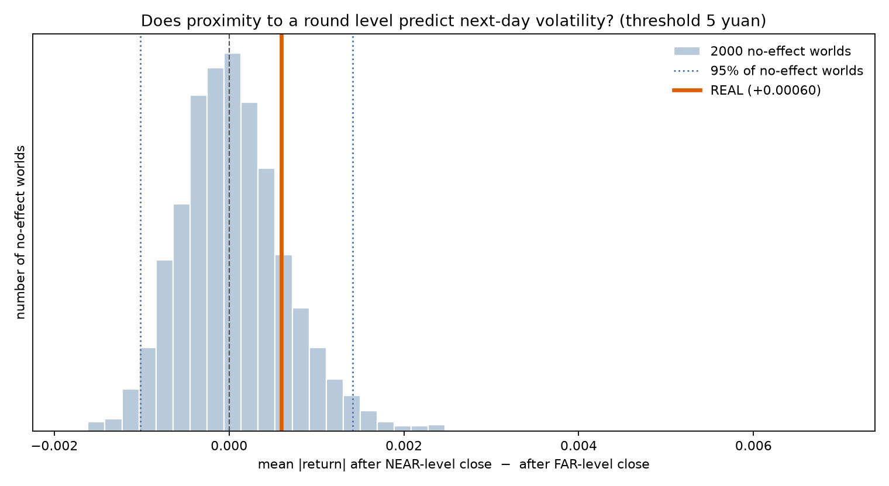

# Stage 5: Level-Proximity and Next-Day Volatility

## Scope

Single pre-committed confirmatory test of support/resistance, run after the
occupancy test (Stage 4) and the descriptive distance-distribution look (Stage 3)
both returned nothing significant. Training window 2006-01-01 to
2020-12-31; 2021+ held out. One primary statistic, one null model, one main
threshold fixed in advance (to avoid data-dredging).

## Question

No look-ahead: is today's absolute log-return larger or smaller when YESTERDAY's
close sat near a 50-level? Statistic = mean|return| after a near-level close minus
mean|return| after a far-level close.

## Null model

Block bootstrap of daily log-returns (block 20, 2000 sims,
seed 12345). Return sizes are unlinked from price level, so any real link
shows as the statistic escaping the null band. The null also captures any purely
mechanical bias (its median need not be zero).

Seed 12345 is shared with Stage 4 (`test_roundnumber_avoidance.py`): the two
stages draw the same block-start array from the same return series, so their null
paths are bit-identical. Each test is individually valid -- the shared paths are a
valid sample from the null -- but the two results are NOT independent and must not be
described as two independent tests both failing to reject. The alignment is
deliberate, making the two stages a controlled comparison.

## Result

- Training observations: 3,664

| near_threshold_yuan | n_days_near | mean_abs_return_after_near | mean_abs_return_after_far | statistic_near_minus_far | null_median | null_p2.5 | null_p97.5 | empirical_percentile_in_null | two_sided_p | outside_95_null_band |
| --- | --- | --- | --- | --- | --- | --- | --- | --- | --- | --- |
| 2.0 | 246 | 0.007704 | 0.007331 | 0.000374 | -1.2e-05 | -0.00121 | 0.001987 | 68.7 | 0.6277 | False |
| 3.0 | 365 | 0.00786 | 0.0073 | 0.00056 | 3e-06 | -0.001138 | 0.001626 | 78.8 | 0.4258 | False |
| 5.0 | 631 | 0.007848 | 0.007253 | 0.000595 | 5e-06 | -0.001012 | 0.001413 | 84.0 | 0.3198 | False |
| 10.0 | 1394 | 0.007798 | 0.007084 | 0.000714 | 6e-06 | -0.000978 | 0.001035 | 91.5 | 0.1699 | False |

`outside_95_null_band` is the decision flag.

## Chart

## Interpretation

INSIDE the null band -> no detectable link. Being near a round level yesterday does not predict a different-sized move today beyond what a mechanical random walk produces.

## What the null median is

The null median for the main threshold is 0.000005, approximately zero. Each of the 2,000 no-effect simulated paths is split by prior-day distance and the same near-minus-far subtraction is performed, giving 2,000 differences from worlds where the true answer is zero; their median is the value above.

It matters because a grouping procedure can manufacture a difference from nothing -- splitting on the contemporaneous close instead of the prior close would do exactly that, because the grouping variable and the outcome would then share a price. A null median at approximately zero is empirical evidence, on the real return series, that the lagged design introduces no mechanical bias.

Contrast Stage 4, whose null median for mean distance is 12.416983, not the theoretical uniform 12.5 -- a real mechanical bias in that statistic. You cannot know which case applies without simulating, which is why the null median is reported in both stages.

## Power

For the pre-specified headline (Distance <= 5), SE = (null_p97.5 - null_p2.5) / (2 * 1.96) = 0.000619. The minimum detectable effect at 80% power is MDE = 2.8 * SE = 0.001732, which is 23.9% of the far-group mean |return| (0.007253).

The MDE exceeds the band edge because the observed statistic is itself random: an effect sitting exactly on the boundary is detected only about half the time. The 2.8 factor is 1.96 (to clear the band) plus 0.84 (for an 80% detection rate).

The observed effect is 0.000595, or 8.2% of the far-group mean, against an MDE of 23.9%. The observed effect is a fraction of what this design can reliably resolve, so the null rules out large effects and is uninformative about effects of the magnitude typically reported in the round-number literature.

## Parkinson volatility (post-hoc robustness)

- `abs_log_return` is the pre-specified primary measure; Parkinson volatility is a post-hoc robustness check added during review, reported here regardless of outcome.
- Parkinson is roughly 5x more efficient at estimating volatility from the same number of days, because it uses the daily high and low rather than a single closing price.
- Parkinson is the measure more closely aligned with the hypothesised mechanism: an intraday rejection at a level shows up in the range but can be nearly invisible in the close-to-close move.
- Against that, `close` comes from a closing auction with substantial volume behind it, while `high` and `low` can be set by a single fill -- which is why the more robust close-to-close measure was chosen as primary.
- Reported on two samples: (a) the analysis sample as used by the primary test, and (b) the same sample with the two extreme-intraday-range dates (2016-03-01, 2021-12-28) reinstated, because excluding days for extreme range and then using range as the outcome would truncate the dependent variable. 2021-12-28 is outside the 2006-2020 training window, so only 2016-03-01 actually re-enters; the two samples differ by one day.

| sample | near_threshold_yuan | n_days_near | mean_abs_return_after_near | mean_abs_return_after_far | statistic_near_minus_far | null_median | null_p2.5 | null_p97.5 | empirical_percentile_in_null | two_sided_p | outside_95_null_band |
| --- | --- | --- | --- | --- | --- | --- | --- | --- | --- | --- | --- |
| analysis_as_is | 2.0 | 246 | 0.007101 | 0.007276 | -0.000175 | -2.6e-05 | -0.000983 | 0.001461 | 39.6 | 0.7916 | False |
| analysis_as_is | 3.0 | 365 | 0.007444 | 0.007244 | 0.000199 | 2e-06 | -0.000902 | 0.001272 | 64.8 | 0.7046 | False |
| analysis_as_is | 5.0 | 631 | 0.007268 | 0.007264 | 4e-06 | 4e-06 | -0.000825 | 0.001029 | 49.9 | 0.9975 | False |
| analysis_as_is | 10.0 | 1394 | 0.007334 | 0.007222 | 0.000112 | -6e-06 | -0.000771 | 0.000787 | 62.1 | 0.7586 | False |
| extreme_dates_reinstated | 2.0 | 246 | 0.007101 | 0.007339 | -0.000238 | -4.2e-05 | -0.001033 | 0.001648 | 36.6 | 0.7326 | False |
| extreme_dates_reinstated | 3.0 | 365 | 0.007444 | 0.00731 | 0.000134 | 7e-06 | -0.000987 | 0.001433 | 59.3 | 0.8146 | False |
| extreme_dates_reinstated | 5.0 | 631 | 0.007268 | 0.007335 | -6.7e-05 | 1e-06 | -0.000889 | 0.001128 | 44.6 | 0.8926 | False |
| extreme_dates_reinstated | 10.0 | 1394 | 0.007486 | 0.007223 | 0.000264 | -1.2e-05 | -0.000831 | 0.000883 | 74.3 | 0.5147 | False |

In this file the `mean_abs_return_after_*` columns hold Parkinson volatility (the column structure matches the primary statistics file). At the headline threshold, (a) gives statistic 4e-06 (band -0.000825 to 0.001029) and (b) gives -6.7e-05 (band -0.000889 to 0.001128). The two samples agree at every threshold, and in both the statistic stays inside the null band. Full results are in `parkinson_robustness.csv`.

## Stages 4 and 5 are one finding, not two

Stage 4 found prices spend slightly less time near levels; Stage 5 finds volatility slightly higher after a near close. These fit a single mechanism -- higher volatility near a level causes faster escape and therefore lower occupancy. That coherence is exactly why they do not corroborate each other: if the volatility effect were real and large it would mechanically produce the occupancy effect. The two results must be described as one finding observed from two angles, not as two independent tests both failing to reject.

## Caveats

- One 15-year path compared to a null band (parametric-bootstrap-style test).
- Failing to reject is not proof of no effect; it means this test found no evidence.
- The block bootstrap breaks the price-level/return link under the null but assumes
  returns are otherwise level-independent.
